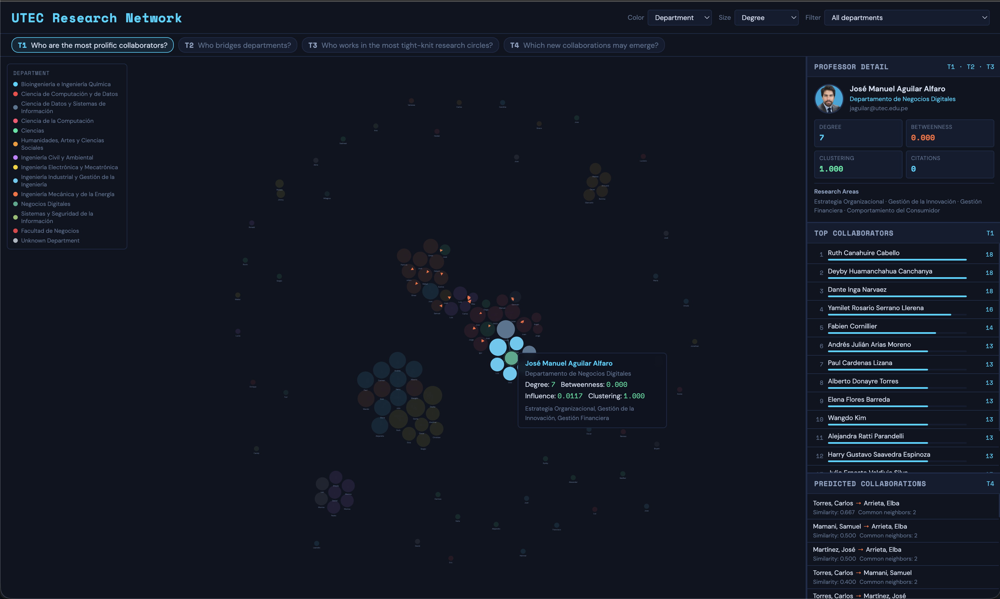

# UTEC Research Network

App that maps research collaboration among UTEC faculty. Edges connect professors who share at least one research group, and the weight is just how many groups they have in common.

## Visualizations

| Component | Technique | Analytical Task |
|---|---|---|
| Network | **Force-directed graph** | T1 · T2 · T3 · T4 |
| Sidebar — ranking | **Bar list** | T1 · T2 · T3 |
| Sidebar — detail | **Profile card** | T1 · T2 · T3 |
| Sidebar — predictions | **Scored pair list** | T4 |

- **T1** – Who are the most prolific collaborators?
- **T2** – Who acts as a bridge between departments?
- **T3** – Who works in the most tight research circles?
- **T4** – Which new collaborations are most likely to emerge?

## Design Desitions

| Decision | Why chosen |
|---|---|
| **Force layout** | The layout is driven by the graph structure itself, so clusters and bridges just appear naturally — you don't have to look for them. |
| **Node size** | Bigger means more important for that task. You can answer T1 and T2 just by looking at which nodes are largest, without reading any numbers. |
| **Departments** | The main thing you want to separate visually is departments. The palette picks maximally distinct hues so 12+ departments don't bleed into each other on a dark background. |
| **Color modes** | Switching to degree, betweenness, or clustering color maps the magnitude of that metric directly onto the graph, so the topology and the metric are readable at the same time. |
| **Prediction edges** | Orange dashed lines read immediately as "not real yet" — they don't compete visually with existing edges and answer T4 without any extra explanation. |
| **Hover** | Dense graphs are hard to read. Fading everything except the hovered node and its neighbours makes the local structure readable without changing the layout. |
| **Tasks** | One click reconfigures color, size, ranking list, and predictions all at once. No manual adjustments needed to switch between tasks. |
| **Click** | Overview first, then details on demand. Clicking a node fills the sidebar with that professor's full profile and metrics. |
| **Prediction** | Clicking a pair in the predicted collaborations list selects the source node and shows its prediction links on the graph directly, regardless of whether T4 mode is active. |

## Analytical Tasks

**T1 — Who are the most prolific collaborators?**

Ruth Canahuire Cabello, Deyby Huamanchahua Canchanya, and Dante Inga Narvaez are the top three, all at degree 18. Switch to degree mode and they're immediately the biggest nodes on the canvas. Worth noting though: high degree here doesn't always mean broad reach — a lot of those connections tend to come from the same large research group.

**T2 — Who acts as a bridge between departments?**

Jose Fiestas Iquira (betweenness 0.050) and Juan Carlos Rodríguez Reyes (0.038) are the two that stand out. Neither has the highest degree, but they sit on the shortest paths between a lot of node pairs across different departments. Take them out and the network fragments.

**T3 — Who works in the most tight research circles?**

Basically, a high clustering coefficient means that a professor's collaborators tend to also collaborate with each other — they form a closed circle. Professors at the top of the T3 ranking sit inside compact cliques where everyone knows everyone. On the other end, low clustering means a professor connects people who don't otherwise interact, which overlaps with the bridge role from T2. You can see this in the graph: the darkest green nodes tend to cluster together visually, while lighter ones have edges spreading outward in many directions.

**T4 — Which new collaborations may emerge?**

The top prediction is Samuel Charca Mamani and Elba Rosaura Vazques Arrieta (Jaccard 0.500, 2 common neighbors) — a cross-department pair who share two mutual collaborators but haven't worked together yet. Cross-department pairs like this are generally the more interesting predictions since they point toward interdisciplinary work that isn't already happening.

## Tasks Coverage

| Task | Views | What you can see |
|---|---|---|
| T1 | Network (size=degree, color=degree), Ranking list | Largest nodes = most connected; ranking sorts top 15 |
| T2 | Network (color=betweenness, size=betweenness), Ranking list | High-betweenness nodes appear between clusters |
| T3 | Network (color=clustering · cohesion), Ranking list | Darkest green nodes = most tight circles; ranking sorts top 15 |
| T4 | Prediction list, Dashed orange edges | Top 20 dashed links show likely future collaborations |

## Visualization Preview



## Project Structure

```
NetworkVis/
├── app.py
├── index.html
├── requirements.txt
├── README.md
├── constants/
│   ├── consts.py
│   └── funcs.py
├── data/
│   ├── network.json        ← base node/group data (source of truth)
│   ├── profiles.json       ← scraped from CRIS UTEC
│   ├── nodes.json          ← generated by build.py
│   ├── edges.json          ← generated by build.py
│   └── predictions.json    ← generated by build.py
├── images/
│   └── visualization.png
├── transform/
│   ├── scrap.py            ← scrapes CRIS UTEC → profiles.json
│   └── build.py            ← builds graph + metrics → nodes/edges/predictions
└── views/
    ├── styles.css
    ├── graphs/
    │   └── network.js
    └── helpers/
        ├── consts.js       ← department names and color palette
        ├── state.js
        ├── sidebar.js
        └── main.js
```

## Setup & Run

```bash
python3 -m venv venv
source venv/bin/activate
pip install -r requirements.txt

# scrape faculty profiles from CRIS UTEC (requires Chrome)
python transform/scrap.py

# build graph data — nodes, edges, metrics, predictions
python transform/build.py

python app.py
```

Open [http://localhost:5050](http://localhost:5050).

## Metrics

Network metrics are computed with NetworkX on the co-membership graph:

| Metric | Description |
|---|---|
| **Degree** | Number of direct collaborators |
| **Betweenness** | Fraction of shortest paths passing through a node (normalized) |
| **Clustering** | How tightly a node's neighbours are connected among themselves |
| **PageRank** | Influence score weighted by connection quality, not just quantity |
| **Citations** | Scraped from UTEC researcher profile |

Link predictions use **Common Neighbors** count and **Jaccard similarity**, filtered to node pairs in the same connected component with at least one shared neighbor.
